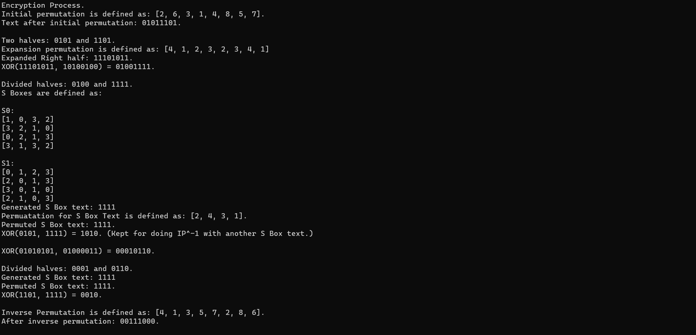
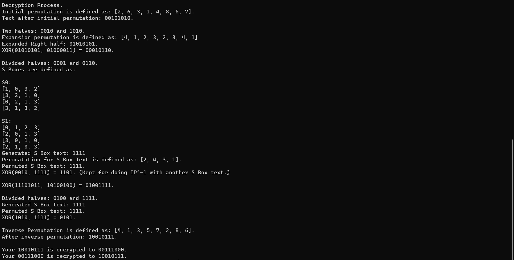

# Simple Data Encryption Standard
A simpler version of DES which is proposed for educational purposes. Unlike Hill cipher and Product Cipher. This is not run as Client-Server Programs.

# Sample Input and Output
Here, I have pasted the sample output for it's better usage.

## Gathering Input from user

## Encryption Process

## Decryption Process

